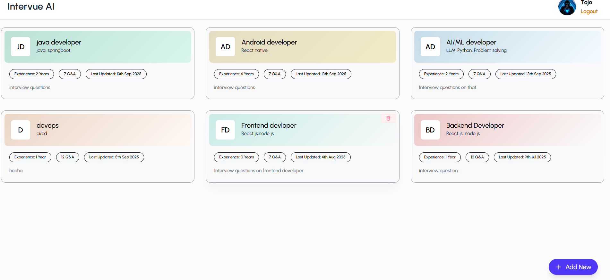
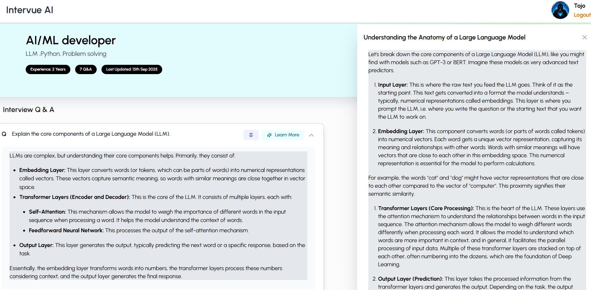

Your personalized interview preparation assistant – generate role-specific questions, expand answers, understand concepts, and track everything in one place. From preparation to mastery, this tool is your ultimate interview companion.

🧠 AI-Generated Questions: Get questions tailored to your role and experience level using Gemini API.

📌 Pin & Organize: Save key questions and answers for quick review.

📝 Answer Expansion: Dive deeper into your answers and improve with AI-powered suggestions.

📚 Concept Explanations: Get crisp, relevant explanations for tricky technical topics.

🔒 User Authentication: Secure sign-up/login with JWT.

🧑‍💼 Session Tracking: Save sessions with context like role, experience, and focus areas.

## 📸 Screenshots

### Dashboard

### Session Tracking

